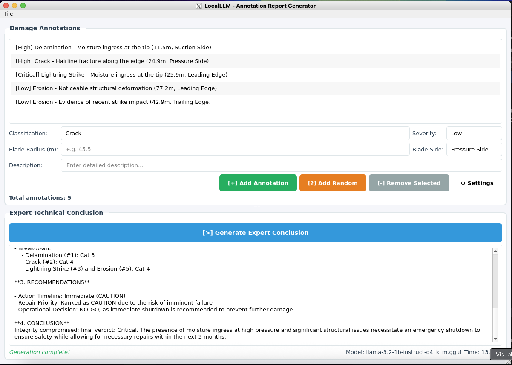

# LocalLLM - Annotation Report Generator

A desktop application built with C++ and Qt6 that integrates a local Large Language Model (LLM) to generate report conclusions based on user annotations. Uses llama.cpp for local inference to ensure complete offline functionality and privacy.



## Features

- ✅ **Privacy-First**: All processing happens locally—no cloud APIs, no data sent externally
- ✅ **Qt GUI**: Clean, responsive interface built with Qt6 Widgets
- ✅ **Annotation Management**: Add and track annotations with ease
- ✅ **Smart Conclusions**: LLM generates contextual conclusions based on annotation count
- ✅ **Background Inference**: Non-blocking UI with threaded LLM processing
- ✅ **LLM Controller**: Manage models, download new ones, and tweak parameters (Temp, Top-P)
- ✅ **Custom Prompts**: Edit and save system prompts directly in the app
- ✅ **Cross-Platform**: Works on Windows, Linux, and macOS
- ✅ **Docker Support**: Consistent build environment with all dependencies

## Documentation
- [LLM Concepts for C++ Developers](LLAMA_CONCEPTS.md): Learn how `llama.cpp` works under the hood.

## Prerequisites

### Option 1: Docker Setup (Recommended)

- **Docker Desktop** (v20.10+)
- **XQuartz** (macOS only, for GUI support)
  - Download from: https://www.xquartz.org/
- **Git** (for cloning repository)

### Option 2: Native Setup

- **Qt 6.x** (6.2 or later recommended)
- **CMake** 3.20 or later
- **C++17 compatible compiler**
  - GCC 9+ or Clang 10+ (Linux/macOS)
  - MSVC 2019+ or MinGW (Windows)
- **Git** (for submodules)

## Quick Start with Docker

### 1. Setup XQuartz (macOS only)

```bash
# Install XQuartz via Homebrew
brew install --cask xquartz

# Start XQuartz
open -a XQuartz

# In XQuartz preferences (XQuartz → Preferences → Security):
# ✓ Enable "Allow connections from network clients"

# Restart XQuartz and add localhost to allowed clients
xhost + localhost
```

### 2. Clone Repository

```bash
git clone --recursive https://github.com/yourusername/local_llm.git
cd local_llm

# If you forgot --recursive, run:
git submodule update --init --recursive
```

### 3. Build Docker Container

```bash
# Build the container (first time only, may take 5-10 minutes)
docker-compose build

# Start the container
docker-compose up -d

# Access the container shell
docker-compose exec localllm bash
```

### 4. Build the Application

Use `docker compose exec` to build the application inside the running container:

```bash
# 1. Configure with CMake (creates the build directory if it doesn't exist)
docker compose exec localllm cmake -B /workspace/build_container -S /workspace

# 2. Build the project (using -j4 for parallel compilation)
docker compose exec localllm cmake --build /workspace/build_container -j4
```

### 5. Download a Model

You need a GGUF format model. We recommend starting with a small quantized model:

**Option A: TinyLlama (1.1B, fastest, ~600MB)**
```bash
docker compose exec localllm bash -c "cd /workspace/models && wget https://huggingface.co/TheBloke/TinyLlama-1.1B-Chat-v1.0-GGUF/resolve/main/tinyllama-1.1b-chat-v1.0.Q4_K_M.gguf -O model.gguf"
```

**Option B: Llama-2-7B (better quality, ~4GB)**
```bash
docker compose exec localllm bash -c "cd /workspace/models && wget https://huggingface.co/TheBloke/Llama-2-7B-Chat-GGUF/resolve/main/llama-2-7b-chat.Q4_K_M.gguf -O model.gguf"
```

### 6. Run the Application

To run the application with GUI support on macOS, ensure **XQuartz** is running and configured (`xhost + localhost`), then execute:

```bash
docker compose exec -T -e DISPLAY=host.docker.internal:0 localllm /workspace/build_container/LocalLLM
```

The GUI window should appear on your host system!

## Native Build Instructions

### Install Qt6

**macOS (Homebrew):**
```bash
brew install qt@6
export Qt6_DIR=$(brew --prefix qt@6)/lib/cmake/Qt6
```

**Ubuntu/Debian:**
```bash
sudo apt-get update
sudo apt-get install qt6-base-dev qt6-tools-dev cmake build-essential
```

**Windows:**
- Download Qt from https://www.qt.io/download-qt-installer
- Run the installer and select:
  - Qt 6.x (latest version)
  - Choose either MinGW or MSVC compiler
  - CMake (if not already installed)
- Install Visual Studio 2019+ (for MSVC) or MinGW-w64

### Build Steps

**Linux/macOS:**
```bash
# Clone with submodules
git clone --recursive https://github.com/yourusername/local_llm.git
cd local_llm

# Create build directory
mkdir build && cd build

# Configure (may need to specify Qt6_DIR)
cmake ..

# Build
cmake --build . -j4

# Run
./LocalLLM
```

**Windows (PowerShell or CMD):**
```powershell
# Clone with submodules
git clone --recursive https://github.com/yourusername/local_llm.git
cd local_llm

# Initialize submodules if you forgot --recursive
git submodule update --init --recursive

# Configure with Visual Studio generator
cmake -B build -G "Visual Studio 17 2022"
# Or for MinGW: cmake -B build -G "MinGW Makefiles"

# Build (Release configuration recommended for better performance)
cmake --build build --config Release -j4

# Run
.\build\Release\LocalLLM.exe
```

> **Note for Windows users**: If CMake can't find Qt6, you may need to specify the Qt path:
> ```powershell
> cmake -B build -G "Visual Studio 17 2022" -DCMAKE_PREFIX_PATH="C:\Qt\6.x.x\msvc2019_64"
> ```
> Replace `6.x.x` and compiler version with your actual Qt installation path.

## Usage

1. **Configure LLM**
   - Click **⚙ Settings** or go to **File > LLM Settings**.
   - Go to the **Models** tab and download a model (e.g., Llama 3.2 1B).
   - Click **Select** once downloaded.
   - (Optional) Adjust **Temperature** or **System Prompt** in the Settings tab.

2. **Add Annotations**
   - Enter text in the input field
   - Click "Add Annotation" or press Enter
   - Repeat to build your annotation list

3. **Generate Report**
   - Click "Generate Expert Conclusion"
   - Wait for the LLM to generate (progress shown in status bar)
   - View the generated conclusion in the output area

4. **Sample Workflow**
   - Add 3-4 annotations → LLM suggests more analysis needed
   - Add 10+ annotations → LLM highlights substantial insights available

## Project Structure

```
local_llm/
├── CMakeLists.txt          # Build configuration
├── Dockerfile              # Docker container definition
├── docker-compose.yml      # Docker orchestration
├── README.md               # This file
├── models/                 # Place GGUF models here
│   └── model.gguf         # Your model file
├── src/
│   ├── main.cpp           # Application entry point
│   ├── mainwindow.h/cpp   # Main UI window
│   └── llamaworker.h/cpp  # LLM inference worker
└── external/
    └── llama.cpp/         # llama.cpp library (submodule)
```

## Troubleshooting

### Model Not Loading

**Error:** "Failed to load model"

**Solutions:**
- Verify model file exists in `models/` directory
- Check file is valid GGUF format (not corrupted download)
- Ensure sufficient RAM (4GB+ for Q4 quantized models)
- Try a smaller model like TinyLlama

### GUI Not Showing (Docker on macOS)

**Error:** "Cannot connect to display"

**Solutions:**
```bash
# Ensure XQuartz is running
open -a XQuartz

# Allow localhost connections
xhost + localhost

# Check DISPLAY variable in container
docker-compose exec localllm echo $DISPLAY
# Should show: host.docker.internal:0

# Restart container if needed
docker-compose restart
```

### Build Errors

**Error:** "Qt6 not found"

**Solution (Native):**
```bash
# macOS
export Qt6_DIR=/opt/homebrew/opt/qt@6/lib/cmake/Qt6

# Linux - install dev packages
sudo apt-get install qt6-base-dev qt6-tools-dev
```

**Error:** "llama.cpp submodule empty"

**Solution:**
```bash
git submodule update --init --recursive
```

### Windows-Specific Issues

**Error:** "Qt6 not found" or "Could not find Qt6"

**Solution:**
```powershell
# Specify Qt path when configuring
cmake -B build -G "Visual Studio 17 2022" -DCMAKE_PREFIX_PATH="C:\Qt\6.x.x\msvc2019_64"

# For MinGW
cmake -B build -G "MinGW Makefiles" -DCMAKE_PREFIX_PATH="C:\Qt\6.x.x\mingw_64"
```

**Error:** "Cannot open include file: 'llama.h'"

**Solution:**
```powershell
# Ensure submodules are initialized
git submodule update --init --recursive

# Clean and rebuild
rmdir /s /q build
cmake -B build -G "Visual Studio 17 2022"
cmake --build build --config Release
```

**Error:** Missing DLL files when running

**Solution:**
```powershell
# Copy Qt DLLs to build directory, or add Qt bin to PATH
set PATH=C:\Qt\6.x.x\msvc2019_64\bin;%PATH%

# Or use windeployqt to copy all required DLLs
C:\Qt\6.x.x\msvc2019_64\bin\windeployqt.exe .\build\Release\LocalLLM.exe
```

### Slow Inference

**Tips for better performance:**
- Use quantized models (Q4_K_M or Q5_K_M)
- Adjust thread count in `llamaworker.cpp` (`ctx_params.n_threads`)
- Use smaller models for testing (TinyLlama)
- Close other applications to free RAM

## Advanced Configuration

### Custom Model Path

You can select a custom model path directly from the **LLM Settings** dialog in the application.

### Adjust Inference Parameters

You can adjust the following parameters in the **LLM Settings** dialog:
- **Temperature**: Controls randomness (0.0 - 2.0). Lower values are more deterministic.
- **Top-P**: Nucleus sampling (0.0 - 1.0). Controls diversity.
- **System Prompt**: Customize the instructions given to the model.

### Console Output

The **LLM Settings** dialog includes a **Console** tab that displays real-time logs from the application and the underlying `llama.cpp` library. This is useful for debugging and monitoring inference progress.

## Development

### Building in VS Code with DevContainer

1. Install "Dev Containers" extension
2. Open project in VS Code
3. Click "Reopen in Container" when prompted
4. Build from integrated terminal

### Code Organization

- **main.cpp**: QApplication initialization
- **mainwindow.{h,cpp}**: UI and annotation management
- **llamaworker.{h,cpp}**: Background LLM inference with llama.cpp API
- **llmcontroller.{h,cpp}**: Settings dialog, model manager, and console
- **consolelogger.{h,cpp}**: Captures stdout/stderr/qDebug for the console tab

## Performance Characteristics

| Model | Size | RAM | Speed (tokens/sec) | Quality |
|-------|------|-----|-------------------|---------|
| TinyLlama Q4 | 600MB | 2GB | 20-40 | Good |
| Llama-2-7B Q4 | 4GB | 8GB | 5-15 | Excellent |
| Llama-2-7B Q8 | 7GB | 12GB | 3-8 | Best |

*Approximate values on modern CPU (Intel i7/Apple M1)*

## License

This project is licensed under the MIT License - see LICENSE file for details.

## Acknowledgments

- [llama.cpp](https://github.com/ggerganov/llama.cpp) - Efficient LLM inference
- [Qt Framework](https://www.qt.io/) - Cross-platform GUI toolkit
- [Meta AI Llama](https://ai.meta.com/llama/) - Foundation models

## Contributing

Contributions welcome! Please:
1. Fork the repository
2. Create a feature branch
3. Make your changes with tests
4. Submit a pull request

## Support

- Report issues: [GitHub Issues](https://github.com/yourusername/local_llm/issues)
- Documentation: [Wiki](https://github.com/yourusername/local_llm/wiki)

---

**Built with ❤️ for offline privacy and local AI**
